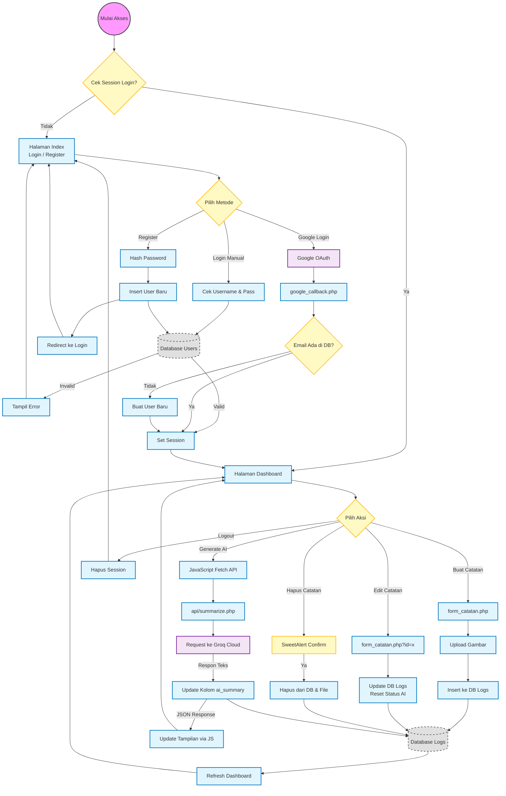

# 🧠 SmartLog - AI-Powered Personal Knowledge Base

**SmartLog** adalah aplikasi web pencatat modern yang terintegrasi dengan **Kecerdasan Buatan (AI)**. Aplikasi ini tidak hanya menyimpan catatan, tetapi juga mampu "membaca" perasaan Anda (Analisis Sentimen) dan memberikan ringkasan cerdas menggunakan teknologi **Groq (Llama 3)**.

Dibangun dengan arsitektur **PHP Native Mid-Level**, **MySQL**, dan antarmuka modern menggunakan **Tailwind CSS**.

---

## ✨ Fitur Utama

### 🔐 Otentikasi & Keamanan
* **Login & Register Aman:** Menggunakan `password_hash` (Bcrypt) dan proteksi *SQL Injection*.
* **Social Login:** Masuk cepat menggunakan akun **Google** (OAuth 2.0).
* **Session Management:** Sistem login berbasis sesi yang aman.

### 📝 Manajemen Catatan (CRUD)
* **Create:** Buat catatan dengan judul, kategori, isi, dan **Upload Gambar**.
* **Read:** Tampilan Dashboard dengan desain *Grid Card* responsif.
* **Update:** Edit konten dan ganti gambar dengan mudah. Status AI otomatis di-reset saat diedit.
* **Delete:** Hapus catatan dengan konfirmasi aman (*SweetAlert2*).

### 🤖 Integrasi AI (Groq / Llama 3)
* **Smart Summary:** Meringkas catatan teknis yang panjang menjadi poin-poin padat.
* **Curhat Analyzer:** Mendeteksi jika catatan berisi keluhan emosional dan memberikan saran/solusi yang menenangkan.
* **Kecepatan Tinggi:** Menggunakan API **Groq Cloud** yang sangat cepat.

### 🎨 UI/UX Modern
* **Glassmorphism Login:** Halaman login estetik dengan background video dan efek kaca (*blur*).
* **Double Slider:** Animasi transisi halus antara form Login dan Register.
* **Responsive:** Tampilan optimal di Desktop dan Mobile (Tailwind CSS).
* **Interactive:** Notifikasi *Toast* dan *Pop-up* modern menggunakan SweetAlert2.

---

## 🛠️ Teknologi yang Digunakan

* **Backend:** PHP 8.x (Native - Procedural/Functional)
* **Database:** MySQL / MariaDB
* **Frontend:** HTML5, Tailwind CSS (via CDN), JavaScript (jQuery)
* **Libraries:**
    * `google/apiclient` (via Composer) - Untuk Google Login
    * `SweetAlert2` - Untuk notifikasi cantik
* **AI Engine:** Groq API (Model: `llama-3.3-70b-versatile`)

---

## 🚀 Instalasi & Persiapan

Ikuti langkah ini untuk menjalankan proyek di komputer lokal (Localhost) menggunakan **Laragon**.

### 1. Prasyarat
* **Laragon** (Rekomendasi) atau XAMPP.
* **Composer** (Untuk menginstal library Google).
* **Koneksi Internet** (Untuk memuat CDN Tailwind & Request API).

### 2. Setup Folder
Letakkan folder proyek di direktori web server:
```text
C:\laragon\www\smartlog\
```
### 3. Instalasi Dependency
Buka terminal di dalam folder proyek tersebut, lalu jalankan:
```bash
composer require google/apiclient
```

### 4. Setup Database
* Buka Database Manager (HeidiSQL / phpMyAdmin).
* Buat database baru bernama `db_smartlog`.
* Jalankan query SQL berikut di tab Query:
```bash
-- Hapus database lama jika ada
DROP DATABASE IF EXISTS db_smartlog;
CREATE DATABASE db_smartlog;
USE db_smartlog;

-- Tabel Users
CREATE TABLE users (
    user_id INT(11) AUTO_INCREMENT PRIMARY KEY,
    full_name VARCHAR(100) NOT NULL,
    username VARCHAR(50) NOT NULL UNIQUE,
    password VARCHAR(255) NOT NULL,
    email VARCHAR(100) DEFAULT NULL,
    google_id VARCHAR(100) DEFAULT NULL,
    avatar VARCHAR(255) DEFAULT NULL,
    created_at TIMESTAMP DEFAULT CURRENT_TIMESTAMP
);

-- Tabel Categories
CREATE TABLE categories (
    category_id INT(11) AUTO_INCREMENT PRIMARY KEY,
    category_name VARCHAR(50) NOT NULL,
    color_code VARCHAR(20) DEFAULT 'bg-gray-100'
);

-- Insert Kategori Bawaan
INSERT INTO categories (category_name, color_code) VALUES 
('Pekerjaan', 'bg-blue-100'), ('Pribadi', 'bg-green-100'), 
('Belajar', 'bg-yellow-100'), ('Ide Project', 'bg-purple-100'), ('Kesehatan', 'bg-red-100');

-- Tabel Logs (Catatan)
CREATE TABLE logs (
    log_id INT(11) AUTO_INCREMENT PRIMARY KEY,
    user_id INT(11) NOT NULL,
    category_id INT(11),
    title VARCHAR(150) NOT NULL,
    content TEXT NOT NULL,
    ai_summary TEXT DEFAULT NULL,
    ai_status ENUM('none', 'pending', 'completed', 'failed') DEFAULT 'none',
    file_path VARCHAR(255) DEFAULT NULL,
    created_at TIMESTAMP DEFAULT CURRENT_TIMESTAMP,
    FOREIGN KEY (user_id) REFERENCES users(user_id) ON DELETE CASCADE,
    FOREIGN KEY (category_id) REFERENCES categories(category_id) ON DELETE SET NULL
);
```

### 5. Konfigurasi (config/constants.php)
Buka file `config/constants.php` dan sesuaikan pengaturan berikut. Penting: Sesuaikan port jika Laragon Anda tidak menggunakan port standar 80 (misal: 2005).
```bash
<?php
// URL Dasar Website (Contoh jika pakai port 2005)
define('BASE_URL', 'http://localhost:2005/smartlog/');

// Kunci API AI (Dapatkan Gratis di console.groq.com)
define('GROQ_API_KEY', 'gsk_xxxxxxxxxxxxxxxxxxxxxxxxxxxxxxxxxxxx');

// Konfigurasi Google Login (Dapatkan di console.cloud.google.com)
// Redirect URI di Google Console harus sama persis dengan GOOGLE_REDIRECT_URL
define('GOOGLE_CLIENT_ID', 'xxxxxxxxxxx.apps.googleusercontent.com');
define('GOOGLE_CLIENT_SECRET', 'GOCSPX-xxxxxxxxxxxxxx');
define('GOOGLE_REDIRECT_URL', 'http://localhost:2005/smartlog/helpers/google_callback.php');
?>
```

---

## 📂 Struktur Folder (Mid-Level Architecture)
Proyek ini menggunakan struktur yang terorganisir untuk memisahkan logika, konfigurasi, dan tampilan.
```text
smartlog/
├── actions/           # Logika pemroses CRUD (Tanpa tampilan)
│   ├── note_create.php
│   ├── note_update.php
│   └── note_delete.php
│
├── api/               # Endpoint API internal (Request AI via AJAX)
│   └── summarize.php
│
├── assets/            # File statis
│   ├── css/           # login.css (Glassmorphism style)
│   ├── js/            # script.js (Logic AJAX & SweetAlert)
│   ├── uploads/       # Tempat penyimpanan gambar user
│   └── video/         # Background video login
│
├── config/            # Konfigurasi
│   ├── database.php   # Koneksi DB dengan Try-Catch
│   └── constants.php  # Konstanta Global & API Keys
│
├── helpers/           # Logika pendukung
│   ├── auth_helper.php      # Login/Register Manual
│   ├── google_setup.php     # Init Google Client
│   └── google_callback.php  # Handle Balikan Google
│
├── includes/          # Potongan layout (DRY Principle)
│   ├── header.php     # Head & CDN
│   ├── navbar.php     # Menu Atas
│   └── footer.php     # Scripts & Footer
│
├── vendor/            # Library Composer (Google API)
├── dashboard.php      # Halaman Utama (Read)
├── form_catatan.php   # Form (Create/Update)
├── index.php          # Halaman Login/Register (Double Slider)
└── logout.php         # Script Logout
```

## 💡 Cara Menggunakan
* Akses Website: Buka `http://localhost:2005/smartlog/` di browser.
* Login/Daftar: Gunakan form manual atau klik tombol Google.
* Buat Catatan: Klik tombol "Buat Catatan Baru", isi judul dan konten.
* Gunakan AI:
  * Di Dashboard, cari kartu catatan yang ingin diringkas.
  * Klik tombol "Generate AI Summary".
  * Tunggu proses (tombol berputar), dan hasil analisis akan muncul.

## 👨‍💻 Credits
Dibuat sebagai proyek latihan penerapan PHP Mid-Level Programming dengan integrasi API Modern.
* Language: PHP 8
* Styling: Tailwind CSS + Custom CSS Glassmorphism
* Database: MySQL
* AI Provider: Groq Cloud (Llama 3)

---

## 🗺️ Flowchart Sistem SmartLog

